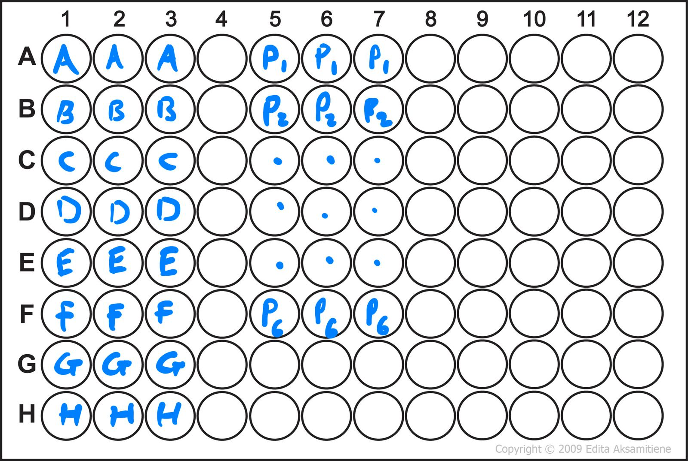

# LabPod

LabPod is a small Python toolkit for lab data analysis - inspired by lab work on Imperial's Medical Biosciences BSc.  
Currently includes `protein_quantifier()` for BSA standard curve fitting + protein concentration calculation from your fixed Excel layout - example below.

[](https://pypi.org/project/LabPod/)
[](https://pepy.tech/project/LabPod)

## Install

```bash
pip install LabPod
```

## How to use
In python file run: 
```python
from labpod import protein_quantifier
protein_quantifier("path to your excel file", number of protein samples)
```
Function works for 96-well plates loaded in the manner.


## Output

The `protein_quantifier()` function generates a BSA standard curve using linear regression and calculates the concentration of unknown protein samples from their absorbance values.

### Example Results
1. Once ran the graph will pop up and you are able to save.
2. When you close the graph the protein concetrations of your samples will show in the terminal

The function returns:
- The fitted regression equation 
- The coefficient of determination (R²)
- A plotted BSA curve
- The calculated protein concentration for each unknown sample (labeled as in the image above) - assuming you sample is the same econcetration as your stock.

